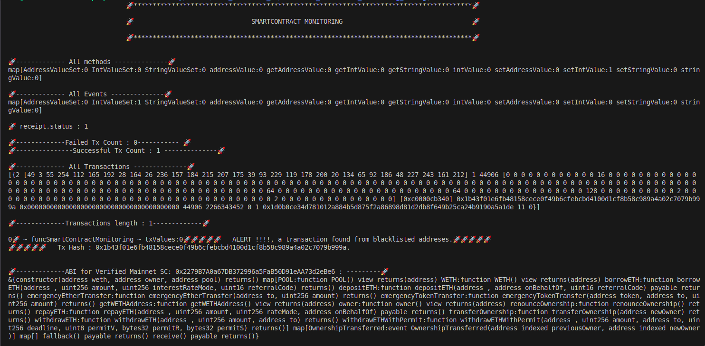

# Blockchain Monitoring Agent

## Setup Instructions

### Prerequisites

- Docker
- Docker Compose
- Go
- Anvil --- _Using `curl -L https://foundry.paradigm.xyz | bash`_
- Deploy the smartcontract on anvil network
- Do some transactions.

### Prerequisites installation
- anvil: https://book.getfoundry.sh/getting-started/installation
- docker: https://docs.docker.com/engine/install/
- docker compose: https://docs.docker.com/compose/install/
- Go: https://go.dev/doc/install

### Get the code of Monitoring Agent

Clone the repository:

git clone https://github.com/dharam-nin/blockchain-alert

### Running the Monitoring Agent using docker

1. `sudo systemctl start docker` on windows just run docker desktop app
2. `docker-compose build`
3. `docker-compose up`

### Running the Monitoring Agent Locally Without Docker

1. **Start local blockchain network:**
   
   run in a new terminal command: 
   
   `anvil`

2. **Go to \blockchain-alert dir in cli** 
   
   run command: 
   
    `go get all`

3. **To include env variables and start the monitoring agent** 

   run command:
   
    `sh start.sh`

# Approach Explanation
## Blockchain Monitoring

### Overview

This system monitors the Ethereum blockchain to detect vulnerabilities, threats, and attacks in real-time. It focuses on analyzing specific metrics related to smart contracts' operations, including function calls, emitted events, transaction numbers, and transaction statuses. This comprehensive approach aims to provide early warnings of potential security issues, facilitating swift remediation efforts.

### Metrics Monitored For BlockCHain Monitoring

- Block Height
   -  Monitoring block height helps in assessing the network's growth and stability. Sudden jumps in block height can indicate rapid network expansion, which might  correlate with increased transaction volumes or new node additions. Conversely, a decrease in block height could signal network contraction or consolidation, potentially indicating reduced activity or security concerns.
- Block Size
   - Block Size measures the amount of data contained in a single block. Large block sizes can indicate high transaction volumes, suggesting a busy network. However, excessively large blocks can lead to longer confirmation times and increased storage requirements for nodes.
- Gas Price
   - Gas Price is the fee paid per unit of computational work required to execute a transaction or smart contract operation. Monitoring gas prices can reveal trends in network demand and supply dynamics.
- Gas Limit
   - Gas Limit sets the maximum amount of computational work that can be performed by a transaction or smart contract execution. Monitoring gas limits helps in managing resource allocation efficiently and ensuring that transactions do not consume excessive resources.
- Gas Used
   - Gas Used tracks the total computational work consumed by transactions and smart contract executions. Monitoring gas usage can help in identifying inefficient transactions or smart contracts that consume unnecessary resources.
- Pending and Queued Transaction
   - Pending and Queued Transactions refer to transactions waiting to be confirmed on the blockchain. Monitoring these transactions can provide insights into network congestion levels and transaction throughput.

#### *Real-Time Monitoring and Security Implications*

By monitoring these metrics in real-time, organizations and network operators can gain actionable insights into the blockchain's performance and security posture. Abnormalities in these metrics, such as sudden spikes in gas prices, block sizes, or pending transactions, can serve as red flags for potential attacks or network congestion issues. Early detection of such anomalies enables swift interventions, such as adjusting transaction fees, optimizing smart contract designs, or scaling network infrastructure to maintain optimal performance and security.

In summary, monitoring block height, block size, gas price, gas limit, gas used, and pending and queued transactions is crucial for maintaining the health, performance, and security of a blockchain network. These metrics provide a comprehensive view of the network's operational status, facilitating proactive management and threat detection strategies.

### Metrics Monitored For Smartcontract Monitoring

- **All Function Calls for Any Contract Address**

   - **Justification**: Identifies abnormal patterns indicative of malicious activities, such as denial-of-service attacks or unauthorized access attempts.
   - **Real-Time Use Case**: Enables immediate detection of unusual patterns, prompting quick interventions to mitigate potential threats.

- **All Events Emitted**

   - **Justification**: Detects anomalous behaviors, such as unexpected event emissions signaling breaches or exploitations of the contract.
   - **Real-Time Use Case**: Alerts administrators to suspicious activities, allowing for rapid response to minimize damage.

- **Number of Transactions**

   - **Justification**: Indicates a contract's popularity and usage, suggesting potential DDoS attacks or loss of trust due to bugs causing transactions to fail.
   - **Real-Time Use Case**: Helps detect potential DDoS attacks or other forms of abuse early, enabling proactive measures to maintain service integrity.

- **Status of Each Transaction for Any Blocknumber**

   - **Justification**: Assesses the operational health of a contract by identifying failed transactions, which could indicate logical errors, incorrect inputs, or vulnerability exploits.
   - **Real-Time Use Case**: Quickly identifies failed transactions warranting investigation, suggesting systemic issues or attempted attacks exploiting known vulnerabilities.

- **Any transaction with higher value than given threshhold**

   - **Justification**: Monitoring transactions for unusual activity, such as values exceeding predefined thresholds, is crucial for security, compliance, and operational integrity. Detect potentially fraudulent activities early, preventing unauthorized transactions and minimizing financial losses.
   - **Real-Time Use Case**: Quickly identifies failed transactions warranting investigation, suggesting systemic issues or attempted attacks exploiting known vulnerabilities.

- **To Check all smartcontract transactions are not from blacklisted addresses**

   - **Justification**: Assesses the operational health of a contract by identifying failed transactions, which could indicate logical errors, incorrect inputs, or vulnerability exploits.
   - **Real-Time Use Case**: Quickly identifies failed transactions warranting investigation, suggesting systemic issues or attempted attacks exploiting known vulnerabilities.

## Setup and Execution

Before running the system, ensure the following environment variables are set:

- `export NODE_URL=`: The URL of the Ethereum node to connect to (e.g., Infura, Alchemy, or a local node).
- `ETHERSCAN_API_KEY`: Your Etherscan API key for accessing contract ABIs.

***Blockchain Monitoring Output***

***Smartcontract Monitoring Output***

